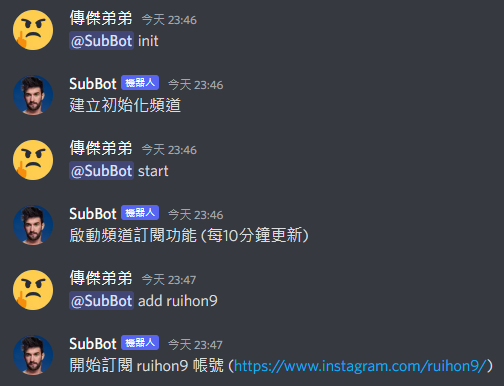
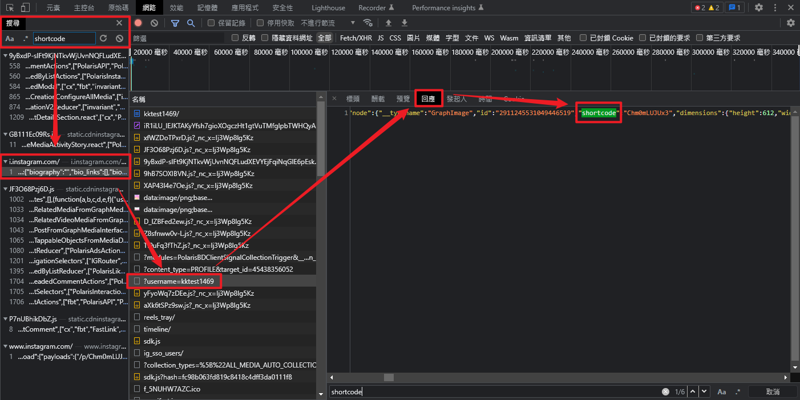
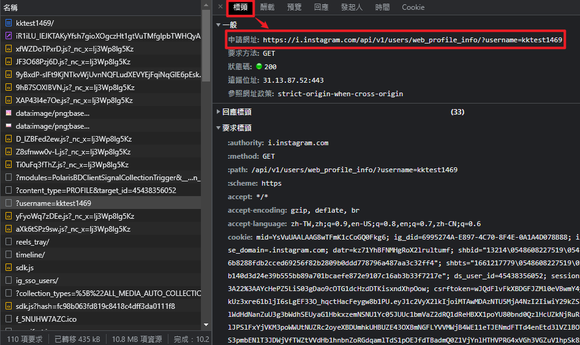
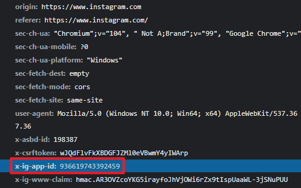

# Discord-Bot-Subscribe-Instagram

## Information

Instagram 貼文更新會自動發布貼文內容到 Discord 的機器人。

## Usage

標記機器人帳號並加上以下操作指令：  
- help : 查看幫助
- start : 自動訂閱發布啟動 (每10分鐘更新)
- stop : 自動訂閱發布停止
- check : 單次即時訂閱檢查
- list : 查看目前訂閱者
- add : 增加訂閱者
- del : 移除訂閱者
- del -all : 移除所有訂閱者

Example：  


## Environment

|套件|版本|備註|
|:-:|:-:|:-:|
|node|v14.20.0|建議 v14 以上|
|discord.js|v12.5.3|新版 API 不相容|
|mongodb|v4.9.0|使用 MongoDB 儲存資料|

環境安裝並執行：
```sh
npm install
npm run start
```

還需建立 `token.json` 保存 "MongoDB 的連線資訊" 和 "Discord Bot 的 Token"，內容如下：  
```json
{
    "mongodb_url": "mongodb://localhost:27017/",
    "token": "..."
}
```

## Web Crawler for Instagram

> 此方法於 2022/08/24 測試可用

大概看一下可發現每篇 IG 貼文網址固定長以下這樣，`shortcode` 為每篇貼文的類似 UID。

https://www.instagram.com/p/`shortcode`/

從 `shortcode` 去找大概可以找到來源位置，試過登入狀態和無登入狀態都一樣。



接著再找到 API 網址如下，是用 GET 的方式，Params 很明顯就是使用者名稱。

https://i.instagram.com/api/v1/users/web_profile_info/?username=`username`



接著看請求內容 Headers 的部分有什麼驗證機制，經過測試 Headers 內包含以下內容就可獲取資料，目前不清楚 `x-ig-app-id` 此標頭是在做什麼，目前測試不論換電腦、換IP、清Cookies、等幾天、登出登入，這個值都不會改變。

```
'x-ig-app-id': '936619743392459'
```



因目前的要求只需爬到最新幾篇貼文的資料，且都以未登入的狀態在爬，能爬到的資料內容也蠻多的，包含貼文基本內容(內文、網址、類型、發文者)、按讚數、留言內容...等等(沒仔細看完整)，但也因為沒登入所以只能爬到幾篇資料(大概10多篇吧不確定)。

## Improvement

* 目前僅限於單個頻道內作用，改成多頻道多伺服器皆可同時使用。
* 新增權限功能，僅限管理員能控制。
* 改善爬蟲方法。
    * 目前僅能間隔時間爬一次資料 (應該只能這樣了?)。
    * 改成登入狀態可爬更多資料 (不限貼文數、不公開帳號...等等)。
    * `x-ig-app-id` 這個 Header 不確定作用也不確定過段時間會不會更動。

## Reference
* Discord API on Javascript  
[discord.js 官方文檔](https://discord.js.org/#/)

* 如何建立 Doscord Bot  
[用 JS 寫一個 Discord Bot！](https://b-l-u-e-b-e-r-r-y.github.io/post/DiscordBot01/)
